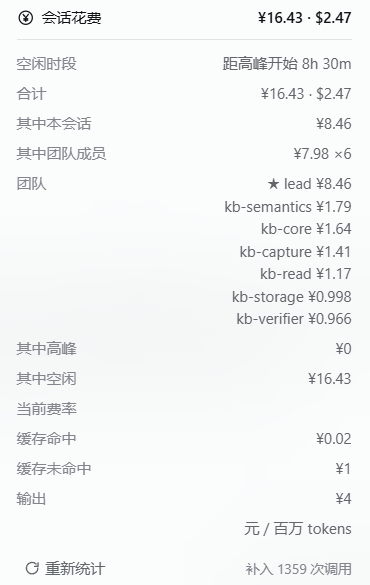

<h1 align="center">dsh-api-cost</h1>

<p align="center">Exact DeepSeek cost estimation for DeepSeek Harness: peak / off-peak rates, durable checkpoint recovery, and delegation or team spend attributed to the session that caused it.</p>

<p align="center">
  <a href="https://github.com/NIRVANA-APOC/dsh-api-cost/actions/workflows/test.yml"></a>
  
  
</p>

<p align="center"><b>English</b> · <a href="README.zh.md">中文</a></p>

---

`dsh-api-cost` 2.0 is a **TypeScript, projection-first** rewrite. Instead of metering streams, replaying logs and polling on a timer, the plugin registers one pure session projection; the Harness owns the event drive, the per-session watermark, the durable checkpoint and the delivery to the browser. The client half reads the host's own projection through the framework `useProjection` seat.

What that buys you:

- **Correct history without a recount button** — the first read of a session, a resumed conversation, or a restart all fold from the durable log through the host's checkpoint cache, so a figure never starts at ¥0 and never double counts.
- **Real settlement semantics** — one billed event per `assistant/message` (or `assistant/attempt` fallback), priced at the *event's* own settlement time, with fork-inherited prefixes excluded from a child's own spend.
- **Honest delegation and team totals** — `self`, `tree` and `team` scopes resolved from durable subagent catalogs and the team roster, with `own` always meaning *this session* and `others = total − own`.
- **Lightweight by construction** — no replay framework, no database, no polling loop. Built artifacts: client ≈ **9.3 KiB gzip**, host ≈ **10.3 KiB gzip**.

**Contents:** [Requirements](#requirements) · [Install](#install) · [Usage](#usage) · [HTTP](#http) · [Rates](#rates) · [Configuration](#configuration) · [What it does not promise](#what-it-does-not-promise) · [Development](#development) · [Migrating from 1.x](#migrating-from-1x) · [License](#license)

## Requirements

- DeepSeek Harness **0.2.0-rc.2** with the `sessionProjections`, `sessionProjectionCache` and `sessionQuery` capabilities mounted (the shipped `web` and `desktop` profiles have them).
- Node.js **24** or newer for development only; the published package ships prebuilt JavaScript.

The plugin declares those services in `inject`, so in a composition without them it stays inactive rather than half-working.

## Install

```sh
dsh plugin --profile web add dsh-api-cost                # from npm
dsh plugin --profile web add /absolute/path/to/checkout  # from a checkout or a git URL
```

The package ships `dist/index.js` (ESM host) and `dist/client.js` (the lazy browser factory), so **installation never runs a compiler**. A local source checkout must be built once with `pnpm build` before it is installed that way.

Host-side features (the projection, `/cost`, `session_cost`, the HTTP reads) take effect immediately. The composer pill appears once the client bundle is composed at startup, so restart DSH once.

## Usage

### The pill

Beside the shipped session-stats pills, the cost pill shows this session's estimated spend and the period in force (**peak** / **off-peak** spelled out in words, never colour alone). It reads the host projection directly, so it repaints when a settlement lands — not on a timer. A `Partial` marker appears whenever any contributing session is unpriced, truncated or unreadable.

| Off-peak | Peak |
| --- | --- |
|  |  |

### The panel

Clicking the pill (or pressing Enter on it) opens a trigger-anchored dialog: totals, the this-session / other-session split, the peak / off-peak split, the priced-call count, coverage, the team roster when the scope is a team, current rates, a rate-card notes row when the published card carries a caveat that affects this scope, the countdown to the next period change, and a **Refresh** button that re-reads the scope instead of replaying logs. Token buckets and the per-model breakdown are deliberately not on the panel; they stay available through `/cost`, `session_cost` and `detail=full`.


### Scopes

| Scope | Meaning |
| --- | --- |
| `auto` (default) | The verified team when the session is a team member, otherwise its delegation tree. |
| `self` | This session only. |
| `tree` | This session plus every durable subagent descendant. |
| `team` | The whole team: lead, members and their descendants. Refused when membership cannot be verified. |

A `team` scope names every member's own money under **Team roster**, with the Lead marked ★:



### Command and tool

| Surface | Behaviour |
| --- | --- |
| `/cost [sessionId] [auto\|self\|tree\|team]` | Prints the same summary the pill shows, including coverage warnings. |
| `session_cost` | Lets the assistant read a session's estimate; defaults to the calling session. |

## HTTP

Two GET-only routes on fixed paths, with no configuration knob:

| Route | Returns |
| --- | --- |
| `/dsh-api-cost/v2/view?session=<id>[&scope=…][&detail=summary\|full][&force=1]` | The unified cost view (ETag; `If-None-Match` answers `304`). |
| `/dsh-api-cost/v2/pricing` | Current period, next transition, rate card and provenance. |

`detail=summary` omits the per-model, roster and recent-call payloads. Non-GET methods answer `405`; unknown parameters, scopes or details answer `400`; an unknown session answers `404`; a cross-site fetch is refused with `403`; a read that outlives its 8-second budget answers `503`. Responses never carry local paths.

## Rates

Published DeepSeek prices, in force from 2026-09-10 12:00 +08:00 (CNY per million tokens):

| Model | Period | Cache hit | Cache miss | Output |
| --- | --- | --- | --- | --- |
| `deepseek-flash` | peak | 0.04 | 2 | 8 |
| `deepseek-flash` | off-peak | 0.02 | 1 | 4 |
| `deepseek-v4-pro` | peak | 0.30 | 9 | 27 |
| `deepseek-v4-pro` | off-peak | 0.15 | 4.5 | 13.5 |

The published USD column is billed as its own column, never converted at a guessed rate. Peak windows are Monday–Friday 09:00–12:00 and 14:00–18:00 Beijing time, excluding statutory holidays; nights, weekends, holidays and 调休 makeup days are off-peak. Money accumulates in exact integer arithmetic (nano-units) and only rounds for display. Years missing from the holiday table resolve **off-peak** and are reported as `holiday-data-missing`.

## Configuration

In the profile patch:

```yaml
- id: dsh-api-cost
  name: 'dsh-api-cost'
  config:
    defaultScope: auto          # auto | self | tree | team
    tool: true                  # register session_cost
    command: true               # register /cost
    holidays:                   # extend or correct the bundled Chinese calendar
      '2027':
        holidays: ['2027-01-01', ['2027-02-05', '2027-02-11']]
        makeupWorkdays: ['2027-02-20']
```

Changing `holidays` changes the projection's fold identity, so stale checkpoints are discarded and rebuilt instead of being mixed with new money.

## What it does not promise

- **It is an estimate, not a bill.** Only published rates and reported token counts are used; grants, discounts, retry billing and third-party routing are invisible here.
- **Only official DeepSeek models are priced.** An unknown id is recorded as `unknown-model` with zero money rather than guessed.
- **A settlement is billed at its settlement time.** A call that crosses a boundary is not split proportionally, because the official documentation defines no such split.
- **Unreadable sessions are reported, not guessed**: they appear as `session-unavailable` with `coverage.status = partial`, and a traversal that exceeds the 400-session budget is marked `scope-truncated`.
- **A malformed usage report is never billed.** The call is counted as an attempt and flagged `invalid-usage` or `missing-usage`, but it adds no money and no tokens, so a total never contains spend that no priced call explains.
- **The Pro routing caveat is a rate-card note, not a coverage gap.** This repository records that official billing for `deepseek-v4-pro` after 2026-09-14 12:00 +08:00 is disputed (whether those requests are served — and billed — as Flash, or keep the Pro column). The plugin cannot verify the provider's policy, so it prices the published Pro column and says so. That note appears **only when the scope actually priced that model**; other card caveats (missing holiday data, calls predating the card) always show, because they shape the rates and period on display.
- **Fork semantics are explicit**: a forked child's own figure excludes the inherited prefix, so ancestors are not billed twice when you look at a branch.

## Development

```sh
pnpm install --ignore-scripts     # dev-only toolchain
pnpm typecheck                    # strict TypeScript over src, test and scripts
pnpm build                        # dist/index.js, dist/client.js, dist/types
pnpm test                         # builds, then runs the Node suite over *.test.ts
pnpm bench                        # size/state budgets plus machine-calibrated timing budgets
```

| Path | Role |
| --- | --- |
| `src/pricing/` | Rate card, holiday calendar, exact BigInt pricing engine. |
| `src/host/projection.ts` | The pure `apiCost` fold and its wire schema. |
| `src/host/query.ts` | Scope resolution, single-flight aggregation, bounded caches. |
| `src/host/http.ts` | The two GET routes, validation and the error taxonomy. |
| `src/client/` | TSX pill and panel, projection seats, one shared cross-session bridge. |
| `test/` | Node-native TypeScript tests: pricing, client bridge, release contract, host integration. |
| `scripts/build.ts` | esbuild host/client plus declaration emission. |
| `docs/baseline.json` | Recorded 1.0.0 measurements the budget gate compares against. |

Measured on Node 24.21 against the recorded 1.0.0 baseline and the same fixtures: 100k settlements price in **12 ms** (was 22.7 ms), a 71-session historical tree aggregates completely in **1.4 ms** cold and **0.05 ms** warm, per-session projection state stays under **6 KiB** after 100k settlements, and the shipped bundles are **9.3 KiB** (client) and **10.3 KiB** (host) gzip.

## Migrating from 1.x

2.0 is a deliberate breaking release: no legacy routes, parameters, configuration keys or data shapes are kept.

| 1.x | 2.0 |
| --- | --- |
| `GET /dsh-api-cost/api`, `/api/session`, `/api/status`, `/api/reconcile` | `GET /dsh-api-cost/v2/view`, `/v2/pricing` |
| `tree=0`, `scope=corpus`, `force` on every route | `scope=self\|tree\|team`, `force=1` on `/view` |
| `routePrefix` configuration | fixed `/dsh-api-cost/v2` |
| Plugin-side log replay, LRU ledgers, recount button | Host projection, durable checkpoint, Refresh |
| Plain-number money | Exact decimal strings folded from BigInt nano-units |
| `index.mjs`, `client.js`, `lib/pricing.mjs` | `src/**/*.ts(x)` compiled to `dist/` |

## License

MIT — see [LICENSE](LICENSE).
