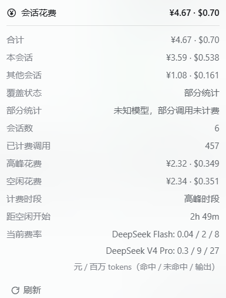

<h1 align="center">dsh-api-cost</h1>

<p align="center">实时计算 DeepSeek 官方 API 花费，区分高峰 / 空闲时段，输入框下方直接显示本会话成本（¥ 与 $ 双币种）。</p>

<p align="center">
  <a href="https://github.com/NIRVANA-APOC/dsh-api-cost/actions/workflows/test.yml"></a>
  
  
</p>

<p align="center"><a href="README.md">English</a> · <b>中文</b></p>

---

DeepSeek 官方 API 是**峰谷计价**：北京时间的工作时段按高峰价，其余时间（含夜晚、周末、法定节假日）按空闲价，空闲价恰好是高峰价的一半。也就是说，同一段对话在 10:00 产生的费用是 20:00 的两倍。DSH 自己只在消息里显示 token 数，不显示钱——这个插件把 token 数换算成钱，且不改变任何请求。

让这个数字可信的有三件事。它按**法定节假日与调休日历**计价，节假日的周一不会被算成高峰；它**自己会重放会话日志**——第一次读取某个会话时自动补录，按 `turn:step` 记账、重复点击不翻倍——所以从侧栏打开一个旧会话、或重启后再进来，看到的都是它真实发生过的调用，而不是 0；它还会**把被委派的花费交代清楚**：子智能体与智能体团队的消耗计入发起它的会话，并拆成「其中本会话」与「其中子会话 ×N」。

它刻意做得很小：**零运行时依赖、无构建步骤、无数据库**——两个源文件加一张价目表，界面只用宿主自带的平台种子模块。

**目录：** [功能](#功能) · [安装](#安装) · [用法](#用法) · [截图](#截图) · [费率](#费率) · [配置](#配置) · [已知限制](#已知限制) · [开发](#开发) · [贡献](#贡献) · [许可](#许可)

## 功能

- **输入框下方一枚胶囊** —— 本会话已花费多少（¥ 与 $），以及当前处于哪个时段。
- **锚定的明细面板** —— 距下次时段切换的倒计时、高峰 / 空闲分项、token 三桶（缓存命中 / 未命中 / 输出）、按模型拆分、进行中的调用。
- **按结算时刻计价** —— 每次模型调用按**结算那一刻**的时段费率计价，跨过边界的会话会把两个时段分开记账，而不是整段按一个价算。
- **子智能体与智能体团队归集** —— 被委派的工作算在**发起它的会话**头上，面板把总额拆成「其中本会话」与「其中子会话 ×N」。
- **历史不用手动补** —— 第一次读取一个会话时自动重放它的日志，所以打开一个旧会话、或重启后回到原来那个，看到的已经包含插件加载前结算的调用。按 `turn:step` 记账，重复点击不会翻倍，面板里的「重新统计」随时可以再按一次。
- **三个出口同一份数字** —— `/cost` 命令、`session_cost` 工具、以及一个纯 GET 的 JSON 快照。
- **零运行时依赖** —— 无需构建步骤、无打包器；界面只用宿主自带的平台种子模块。

## 安装

```sh
dsh plugin --profile web add dsh-api-cost             # 从 npm 安装
dsh plugin --profile web add <仓库或本地目录的绝对路径>   # 从 GitHub / 本地目录安装
```

Host 半边（计量、`/cost`、`session_cost`、HTTP 快照）**立即生效**；Client 半边（输入框下方那枚胶囊）在启动时合成插件清单，所以**需要重启一次 DSH** 才能看到。

对应面板操作：设置 → 插件 → 安装 bundle，target 填上面的包名或路径。桌面端把 `--profile web` 换成 `--profile desktop`。

本插件在 DeepSeek Harness 0.2.0-rc.2 上开发与验证。它是 bundle 包（`package.json` 里的 `dsh.bundle` + 旁边的 `cordis.patch.yml`），无运行时依赖、无需构建，因此源码安装与 npm 安装等价。

## 用法

### 胶囊

输入框下方一枚胶囊，和官方的**会话统计**、**Token 用量**并排。它显示两件事：

- 本会话目前花了多少（¥ 与 $）；
- 当前时段——**峰**（高峰）还是**谷**（空闲），用文字表示并跟随界面语言，不只靠颜色区分。

高峰时段整枚胶囊转为警示色，所以 10:00 开的长任务和 20:00 开的一眼就能分辨。

### 明细面板

点击胶囊（或对它按回车）在正上方弹出面板，点击外部或按 Esc 关闭，关闭时面板从 DOM 移除：

- 当前时段、**为什么**是它（周末 / 法定节假日 / 调休上班日），以及距下次切换的倒计时；
- 合计（¥ 与 $）；
- **本会话 / 子会话分项**，以及高峰 / 空闲分项；
- 进行中的调用；
- token 三桶：缓存命中、缓存未命中、输出；
- 按模型拆分；
- 当前生效费率——命中 / 未命中 / 输出三行各自成行，金额右对齐，单位单独作脚注。

### 子会话与智能体团队

**子会话**：开了子智能体后，他们的花费算在委派它的那个会话头上——胶囊与面板显示整棵委派树的合计，并拆成「其中本会话」和「其中子会话 ×N」两行，总额不会看起来凭空冒出来。归属来自会话自身声明的 `parentSession`（`session/created`），并以 `subagent/start` 作为兜底，所以即使子会话没有自报头部也能归到父会话；多层委派会一路累加。

**智能体团队**：Team 成员的会话在宿主里就是 Lead 的子会话，因此**只要会话是 Team 成员，它报出的就是整个 Team 的合计**——任意座位都能看到全队，面板里 Lead 前置 ★，并把「团队成员 ×N」与名单列出来。成员身份来自宿主自带的 Agent Teams 服务（`tryMembership()` / `listMembers()`），不是插件自己维护的名单。

口径可以按请求固定：默认 `auto`（Team → 委派树 → 自身），`team` 强制全队，`tree` 只看自己的委派树，`self` 只看自己。

### 命令与工具

| 出口 | 行为 |
| --- | --- |
| `/cost [sessionId]` | 打印同一份摘要，含当前时段与费率。 |
| `session_cost` | 让助手自己查会话成本；不传 id 即当前会话。 |

### HTTP 接口

所有路由**只接受 GET**，且刻意**不在 `/api` 之下**——那条桥属于连接层，自带请求信任策略，页面里的裸 GET 会被回 401：

| 路由 | 返回 |
| --- | --- |
| `/dsh-api-cost/api?session=<id>[&scope=auto\|tree\|team\|self][&force=1]` | 完整快照 |
| `/dsh-api-cost/api/session?session=<id>` | 单个会话的账本 |
| `/dsh-api-cost/api/status` | 当前时段、价目表与下次切换时刻 |
| `/dsh-api-cost/api/reconcile?session=<id>&scope=…` | 重放会话日志并返回重新统计报告（`scope=corpus` 可扫全部会话） |

## 截图

输入框胶囊的两种时段状态，以及它展开后的明细面板（界面文案跟随应用语言）：

| 空闲 | 高峰 |
| --- | --- |
|  |  |




## 费率

价目表为 DeepSeek 官方公布，2026-09-10 12:00 +08:00 起生效（元 / 百万 tokens）：

| 模型 | 时段 | 缓存命中输入 | 缓存未命中输入 | 输出 |
| --- | --- | --- | --- | --- |
| `deepseek-flash` | 高峰 | 0.04 | 2 | 8 |
| `deepseek-flash` | 空闲 | 0.02 | 1 | 4 |
| `deepseek-v4-pro` | 高峰 | 0.30 | 9 | 27 |
| `deepseek-v4-pro` | 空闲 | 0.15 | 4.5 | 13.5 |

$ 为官方独立公布的美元列，不是汇率换算。

**时段规则**（北京时间，UTC+8，无夏令时）：高峰为周一至周五 **09:00–12:00** 与 **14:00–18:00**，不含中国法定节假日；其余全部时段——夜晚、周末、法定节假日、调休上班日——都是空闲价，恰为高峰价的一半。边界按半开区间取整：`[09:00,12:00)`、`[14:00,18:00)`，12:00 与 18:00 整点算空闲。内置 2025、2026 两年的中国法定节假日与调休安排（依据国务院办公厅通知）；**未收录年份一律按空闲价估算并明确标注**，而不是猜成高峰。

## 配置

在 profile 补丁里覆盖插件的行即可：

```yaml
- id: dsh-api-cost
  name: 'dsh-api-cost'
  config:
    routePrefix: /dsh-api-cost/api   # 只在与既有路由冲突时需要改
    tree: true                       # 子会话计入父会话（默认）
    team: true                       # Team 成员默认报全队（默认）
    holidays:                        # 追加未来年份，或修正某年安排
      '2027':
        holidays: ['2027-01-01', ['2027-02-05', '2027-02-11']]
        makeupWorkdays: ['2027-02-20']
    autoRecount: true                # 首次读取某个会话时自动重放它的日志
    tool: true                       # 注册 session_cost 工具
    command: true                    # 注册 /cost 命令
```

想让某个会话只报自己（不计委派树），可以在请求上加 `&tree=0`：`GET /dsh-api-cost/api?session=<id>&tree=0`；也可以直接把上面的 `tree` 关掉。

`routePrefix` 默认**不在 `/api` 之下**：那条桥自带请求信任策略（页面里裸 GET 会被回 401），所以插件用自己的路径，与生态里其它计价插件一致。

## 已知限制

- **是估算，不是账单。** 只按官方价目表与模型上报的 token 计费；赠送余额、优惠、失败重试的真实扣费方式无法从这里看到。
- **只支持 DeepSeek 官方价目表。** 其它厂商或第三方中转路由的模型不参与计价（会标为未知模型，费用为 0 而不是猜一个价）。
- **只统计插件加载之后结算的调用**，但第一次读取某个会话时会自动重放它的日志——重启后回到的会话按日志计价，而不是从零开始。日志不可读的组合里，面板的「重新统计」会明确报错，而不是假装成功。
- **子会话归属依赖运行时。** 会话树优先由 `subagents.listDescendants()` 解析，取不到时退回会话自身声明的 `parentSession` / `subagent/start`。进程重启前已经结束、且当时未被记录的委派关系无法事后补齐。
- **价目表是手工维护的。** 官方没有机器可读的价格接口，调价后需要更新 `lib/pricing.mjs` 并重启。
- **`deepseek-v4-pro` 的路由存在官方口径冲突**（2026-09-14 12:00 后是被路由到 Flash 按 Flash 计费，还是保持原计费）。插件按 Pro 价目表计价，并在快照的 `routingDisputed` 字段里标出该冲突，而不是静默替你选一个。
- **跨时段的那一次调用**按结算时刻的时段计价，不做按时长比例拆分（官方文档未规定）。

不占用面板版面的几种估算边界——早于票价卡生效日的调用、节假日日历缺失的年份、上面的路由冲突——Host 半边仍在快照里给出对应字段（`holidayDataMissing` / `beforeCurrentCard` / `routingDisputed`，以及价目表来源与生效日），需要时直接读 `GET /dsh-api-cost/api`。

## 开发

```sh
npm test        # node --test —— 120 项测试，无需安装任何依赖
```

| 文件 | 作用 |
| --- | --- |
| `index.mjs` | Host 半边：监听模型调用与用量、按结算时刻计价、记账、HTTP 路由、工具与命令 |
| `client.js` | Client 半边：输入框下方的胶囊与明细面板 |
| `lib/pricing.mjs` | 价目表、峰谷日历、计价函数（纯函数、零依赖） |
| `test/` | 120 项测试：计价引擎、Host 记账、Client bundle |
| `cordis.patch.yml` | 插入插件行的 bundle 补丁 |

Client bundle 通过 `window.__ModuleLoader__.load({ id: <包名> })` 注册自己，这个 id **必须等于包名**：combo 路由把每个 client bundle 合成一个脚本下发，注册键不对会拖垮整条响应。`test/client.test.mjs` 从 `package.json` 读取期望值，所以改名不会悄悄绕过这条约束。

## 贡献

欢迎提 issue 和 PR。提交前请先跑一遍 `npm test`——测试套件就是计价引擎、账本与 client bundle 的契约。

## 许可

MIT，见 [LICENSE](LICENSE)。
